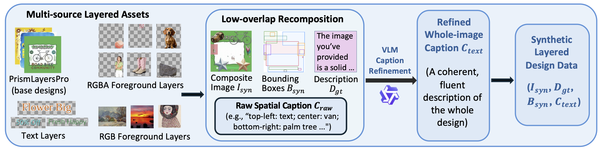

# SynLayers: Does Synthetic Layered Design Data Benefit Layered Design Decomposition?

[](https://opensource.org/licenses/MIT)
[](https://www.python.org/)

## Overview
<p align="center">
  <br>
  <i>Overview of construction of SynLayers. Multi-source assets, including base designs, RGBA/RGB foregrounds, and text layers, are recombined with a low-overlap algorithm to generate composite images, spatial bounding boxes, and raw layout descriptions. A VLM refines these into coherent whole-image captions. The output is a fully synthetic layered dataset comprising composite images, ground-truth layer boxes, and structured captions, which provides complete supervision for decomposition training.</i>
</p>

**SynLayers** is a two-stage pipeline that decomposes a real-world image into transparent, stackable RGBA layers guided by bounding boxes and text captions.

| Stage | What it does |
|-------|-------------|
| **Stage 1 – Bbox-caption-8b** | A fine-tuned Qwen3-VL-8B model that produces a whole-image caption and per-object bounding boxes from a single image |
| **Stage 2 – SynLayers FLUX** | A FLUX.1-dev-based diffusion model that takes the image + bboxes + caption and generates transparent RGBA layers for each region |

Model weights are hosted on HuggingFace: [SynLayers/Bbox-caption-8b](https://huggingface.co/SynLayers/Bbox-caption-8b)

---

## Requirements

- **GPU**: NVIDIA GPU with ≥ 24 GB VRAM (A100 recommended for full pipeline)
- **CUDA**: 12.1+
- **Python**: 3.10+

---

## Setup

### 1. Clone this repo

```bash
git clone https://github.com/YangHaolin0526/SynLayers.git
cd SynLayers
```

### 2. Create a conda environment

```bash
conda create -n SynLayers python=3.10 -y
conda activate SynLayers
```

### 3. Install dependencies

```bash
pip install -r requirements.txt
```

> For exact reproducibility, use the pinned versions in `environment.yml`:
> ```bash
> conda env create -f environment.yml
> conda activate SynLayers
> ```

### 4. Download model checkpoints

The download script fetches all required weights from HuggingFace:

```bash
# Download FLUX.1-dev base model + ControlNet adapter + SynLayers LoRA checkpoints
python tools/download_ckpt.py --download-synlayers
```

This places everything under `./ckpt/`:

```
ckpt/
├── FLUX.1-dev/                            # ~24 GB
├── FLUX.1-dev-Controlnet-Inpainting-Alpha/ # ~3.7 GB
├── trans_vae/
│   └── 0008000.pt
├── pre_trained_LoRA/
├── prism_ft_LoRA/
└── SynLayers_ckpt/
    └── step_120000/
        ├── transformer/
        └── adapter/
```

To skip large base models if you already have them:

```bash
python tools/download_ckpt.py \
  --download-synlayers \
  --flux-dir /path/to/existing/FLUX.1-dev \
  --adapter-dir /path/to/existing/FLUX.1-dev-Controlnet-Inpainting-Alpha
```

---

## Usage

### Option A: Single-image demo (recommended)

Run the full two-stage pipeline on one image:

```bash
python infer/real_infer.py --image /path/to/your/image.png
```

Outputs are saved to `./outputs/` and include:
- `origin.png` — resized input
- `background_rgba.png` — background layer (RGBA)
- `layer_0_rgba.png`, `layer_1_rgba.png`, … — per-object layers (RGBA)
- `merged.png` — composited result (RGB)
- `bbox_vis.png` — detected bounding boxes overlay
- `inference_meta.json` — metadata (boxes, caption, config)

### Option B: Batch inference from a JSONL file

**Step 1 – Generate bounding boxes and captions** (Stage 1):

```bash
python infer/run_caption_bbox_infer.py \
  --data-dir /path/to/images \
  --output outputs/caption_bbox_infer.jsonl \
  --model SynLayers/Bbox-caption-8b
```

The JSONL format per line:

```json
{
  "sample_or_stem": "my_image",
  "image": "my_image.png",
  "whole_caption": "A street scene with cars and pedestrians...",
  "bboxes": [[50, 80, 400, 600], [420, 100, 900, 700]],
  "num_layers": 2,
  "coord": "top_left"
}
```

**Step 2 – Run SynLayers decomposition** (Stage 2):

Edit `infer/infer.yaml` to point to your data and checkpoint paths, then:

```bash
python infer/infer.py --config_path infer/infer.yaml
```

---

## Gradio Demo

Launch a local web UI:

```bash
pip install gradio
python demo/app.py
```

Then open `http://localhost:7860` in your browser.

---

## Project Structure

```
SynLayers/
├── models/                    # Model architecture
│   ├── mmdit.py               # Custom FLUX transformer
│   ├── multiLayer_adapter.py  # Multi-layer ControlNet adapter
│   ├── pipeline.py            # Custom inference pipeline
│   └── transp_vae.py          # Transparent VAE
│
├── infer/                     # Inference scripts
│   ├── real_infer.py          # Single-image end-to-end pipeline
│   ├── infer.py               # Batch inference (JSONL input)
│   ├── run_caption_bbox_infer.py # Stage 1: bbox + caption generation
│   ├── vlm_bbox_inference.py  # VLM utilities
│   └── infer.yaml             # Config template
│
├── tools/
│   ├── download_ckpt.py       # Download checkpoints from HuggingFace
│   └── tools.py               # Shared utilities
│
├── demo/
│   └── app.py                 # Gradio web demo
│
├── eval/                      # Evaluation scripts
├── train/                     # Training scripts
├── requirements.txt
└── environment.yml
```

---

## How It Works

1. **Stage 1 (Bbox-caption-8b)**: A Qwen3-VL-8B model fine-tuned to simultaneously caption an image and predict bounding boxes for each visible layer/object. Output format is a single JSON with `whole_caption` and `boxes`.

2. **Stage 2 (SynLayers FLUX)**: A FLUX.1-dev model augmented with:
   - A **Transparent VAE** that encodes/decodes RGBA (4-channel) images per layer
   - A **Multi-layer ControlNet adapter** conditioned on the input image
   - **Layer positional embeddings** to distinguish layers within the same denoising pass
   - **LoRA fine-tuning** for coherent multi-layer generation


## Citation

If you use SynLayers in your research, please cite:

```bibtex
@article{wu2026does,
  title={Does Synthetic Layered Design Data Benefit Layered Design Decomposition?},
  author={Wu, Kam Man and Yang, Haolin and Chen, Qingyu and Tang, Yihu and Chen, Jingye and Chen, Qifeng},
  journal={arXiv preprint arXiv:2605.15167},
  year={2026}
}
```
